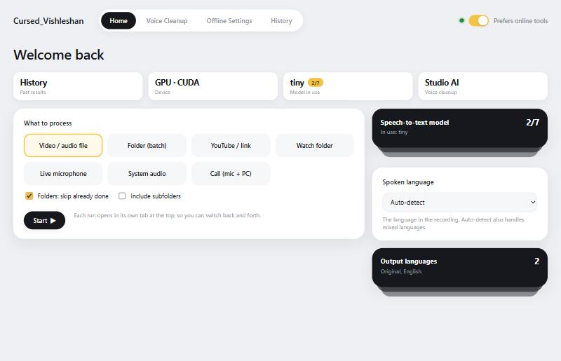
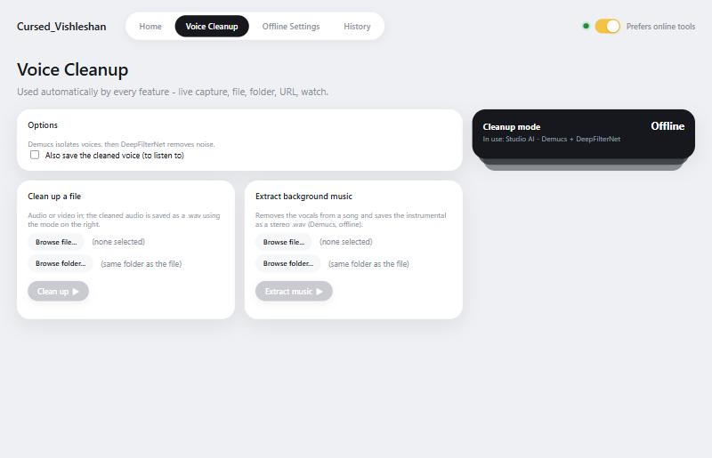
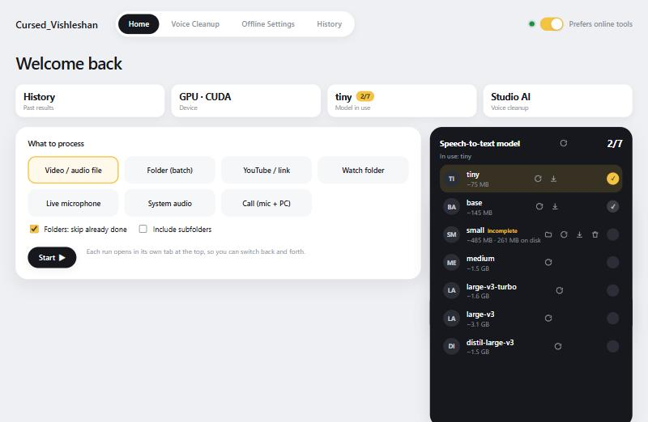
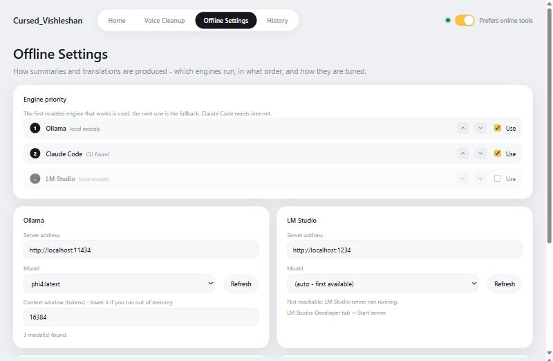

# Cursed_Vishleshan

A Windows desktop app that **transcribes, translates and summarizes** video, audio and live sound, cleans up noisy voices, and pulls the background music out of a song.

- Speech recognition runs **locally** with Whisper (GPU-accelerated on NVIDIA cards).
- Summaries and translations use whichever AI backend you have: online (**Claude Code**) or fully offline (**Ollama** / **LM Studio**).
- The interface is a native `pywebview` window (HTML/CSS/JS in `web/`). No browser, no server address: run it like any desktop app.



> Screenshots are renders of the real UI with sample data.

## Contents

1. [Features](#features)
2. [Interface tour](#interface-tour)
3. [Quick start](#quick-start)
4. [Setup in detail](#setup-in-detail)
5. [Usage walkthrough](#usage-walkthrough)
6. [Output files](#output-files)
7. [Architecture](#architecture)
8. [Troubleshooting](#troubleshooting)
9. [Privacy and security](#privacy-and-security)
10. [Known limitations](#known-limitations)
11. [Roadmap](#roadmap)
12. [License](#license)

---

## Features

### Sources: what you can process

| Source | What it does |
|---|---|
| **Video / audio file** | Transcribe, translate and summarize one file (mp4, mkv, mov, avi, webm, mp3, wav, m4a, flac and more) |
| **Folder (batch)** | Every media file in a folder, optionally with subfolders, skipping ones already done; writes a batch report |
| **YouTube / link** | Download with yt-dlp (playlists too), then process. Needs internet |
| **Watch folder** | Keeps watching a folder and processes new files once they finish copying. Has a Stop button |
| **Live microphone** | Real-time transcript as you speak |
| **System audio** | Captures PC sound (WASAPI loopback) and transcribes it live |
| **Call** | Mic ("You") and PC sound ("Them") together, labelled per speaker |

### Transcription and language handling
- **Whisper models** from `tiny` to `large-v3` plus `distil-large-v3`, downloaded on demand with live progress. The selected model is remembered.
- **GPU acceleration** is automatic (CUDA via CTranslate2). Falls back to CPU when no usable GPU or libraries are found.
- **Spoken-language detection** over the whole recording. Mixed-language audio is transcribed piece by piece in each detected language.
- **Custom vocabulary** (names, terms, abbreviations) that Whisper is nudged toward and that translations/summaries keep.
- Hallucination and repetition filtering on silent or noisy stretches.
- **Speaker labels:** optional *Speakers* setting (Off / Auto-detect / 2-6) adds `Speaker 1:`, `Speaker 2:` to the transcript, subtitles and summaries. Runs offline with sherpa-onnx; two small models (~46 MB) download once.
- **Export to Word / PDF:** *Export* setting on Home saves each summary (plus the chapters, if enabled) as `.docx` and/or `.pdf` next to it; History has **Export Word / Export PDF** buttons for any past summary. PDFs are printed by Microsoft Edge, so Hindi, Urdu, Arabic and other scripts render correctly.
- **Chapters & key points:** optional checkbox on Home. Writes `<name>_chapters.md` with timestamped chapters (YouTube-style list) and key points under each, in the first output language. Uses the summary AI, so it adds time.
- **Word timing:** optional checkbox. Writes `<name>_words.csv` (every word with start/end time, confidence, speaker) and cuts long subtitle cues at natural pauses.
- **Subtitles:** `.srt` and/or `.vtt` for the original and every translation.
- **Speech speed:** slow fast speech (songs, rap) down to 85-50% before recognition, pitch kept; timestamps stay in original time.

### Translation and summaries
Tried in order; the first engine that works wins (order and on/off are configurable in Offline Settings):

1. **Claude Code CLI** (`claude -p`): best quality, needs internet
2. **Ollama**: any model installed locally
3. **LM Studio**: any model served locally
4. English only, last resort: Whisper's own offline translation

Long transcripts are summarized in parts first, so length is not a limit. Key video frames can be sent to vision-capable models.

### Voice cleanup
Applied automatically to every feature and also available as a standalone tool.

| Mode | Engine | Network |
|---|---|---|
| Off | none | none |
| Light filter | ffmpeg | Offline |
| Strong filter | ffmpeg | Offline |
| Studio AI | **Demucs** voice isolation + **DeepFilterNet** noise removal | Offline |
| ElevenLabs Voice Isolator | ElevenLabs API | Online |

- **Clean up a file:** pick any audio/video file and an output folder; get a cleaned `.wav`.
- **Extract background music:** pick a song; Demucs removes the vocals and saves the instrumental as a **stereo** `.wav`.
- Studio AI falls back step by step (for example to the Strong filter) if a model is missing, rather than failing.



### Live capture (microphone / system audio / call)
- Record/Stop, input level meters, device pickers.
- Committed text vs. provisional text while you speak; per-speaker labels in call mode.
- **Live caption overlay:** an always-on-top subtitle bar in its own small window. Shows original words, fast offline English, or a translation. Adjustable size, lines, width, opacity, colours, position; optional original-words line, no-background mode, read-aloud.
- **Alert words:** flags when a keyword is spoken.
- **Translate**, **Read aloud**, **Copy**, **Clear**.
- **Save:** transcript + audio + a History entry.
- **Clean up & re-transcribe:** runs the whole recording through your cleanup mode (Studio AI by default), transcribes it again at full quality and replaces the live text.

### Settings and quality of life
- **Online / Offline preference toggle** (top right): which tools are preferred by default (Claude / ElevenLabs / edge-tts vs. Ollama / LM Studio / local cleanup). It never disables an option. A separate light shows real internet status.
- **Offline Settings:** engine priority, server addresses and models, Ollama context window, frames sent to vision models, per-call timeout, chunk sizes.
- **Model management:** the Whisper model list is a card deck. Each model has icons to open its folder, re-check it, delete it, or delete and download again. Interrupted downloads are tagged *incomplete*.
- **Drag and drop:** drop video/audio files (several at once) or a folder anywhere on the window to start File / Folder jobs.
- **Stop any job:** every job panel has a **Stop** button. A waiting job leaves the queue; a running one stops within moments (its ffmpeg / helper programs are ended too) and the next queued job starts.
- **One tab per tool run:** every file / folder / link / watch / live / cleanup / music run opens its own tab in the top bar. Closing a tab closes a live session or stops a watch job.
- **Click to play:** in History, timestamped transcript lines are clickable and play the original recording from that point (video or audio; formats the built-in player can't handle are converted to a small mp3 in `Documents\Cursed_Vishleshan\cache`). The line being played is highlighted.
- **History:** searchable list of everything processed, with preview, open file, show in folder and remove.
- Read-aloud: Microsoft neural voices online (edge-tts), built-in Windows voices offline.
- Keeps Windows awake during long batch jobs.

---

## Interface tour

The top bar has the pill tabs **Home / Voice Cleanup / Offline Settings / History**, then one tab per running tool, then the online/offline switch and internet light.

### Home
- **Stat cards** across the top: **History** (opens it), **Device** (GPU or CPU in use), **Model in use** (with a flag showing how many models are downloaded; click to open the model list), **Voice cleanup** (current mode; click to open it).
- **What to process** (left): pick the source type, choose the file/folder/link, optional *skip already done* and *include subfolders*, then **Start**.
- **Right column:** a **Whisper model deck**, the **Spoken language** picker, and an **Output languages** deck. Decks are stacks of cards: hover to fan out, click to pin open. They overlap the content below instead of pushing it.



### Voice Cleanup
Options (mode help, ElevenLabs key, keep cleaned voice), *Clean up a file* and *Extract background music* side by side, and the mode deck on the right.

### Offline Settings
Engine priority list, Ollama and LM Studio cards (address, model, refresh, status), picture settings, and limits.



### History
Search across titles, languages and the full text of transcripts and summaries. Preview on the right; open file, show in folder, remove.

---

## Quick start

Requires **Windows**, **Python 3.10+** and [ffmpeg](https://ffmpeg.org/) on `PATH`.

```bash
pip install -r requirements.txt
python app.py
```

or double-click `Cursed_Vishleshan.bat` (no console window; errors go to `app.log`). `Cursed_Vishleshan_debug.bat` keeps a console open to watch the output live.

On the Home screen: click a Whisper model to download it, pick a source, press **Start**. The first run of anything needing a model (Whisper, Demucs, DeepFilterNet) downloads it once and reuses it afterwards.

---

## Setup in detail

`requirements.txt` is pinned to what is tested here and split into core and optional parts. Its header explains what to drop if you have no NVIDIA GPU or an older one.

| Feature | Needs |
|---|---|
| Core transcription + UI | `faster-whisper`, `pywebview`, `sounddevice`, `PyAudioWPatch`, `yt-dlp`, `edge-tts` |
| GPU transcription | `nvidia-cublas-cu12`, `nvidia-cudnn-cu12` |
| Studio AI cleanup + music isolation | `demucs` and `torch` (a CUDA 13 build for RTX 50-series; see `requirements.txt`). DeepFilterNet is downloaded as `tools/deep-filter.exe`; the `deepfilternet` pip package is **not** needed |
| ElevenLabs cleanup | An ElevenLabs API key (Voice Cleanup tab) |
| Offline summaries/translations | [Ollama](https://ollama.com) or [LM Studio](https://lmstudio.ai) with a model downloaded |
| Best-quality summaries/translations | [Claude Code](https://claude.com/claude-code) installed and logged in |

### GPU notes
- Whisper (CTranslate2) uses the **CUDA 12** cuBLAS/cuDNN pip packages. The app registers their DLL folders itself.
- PyTorch for Demucs is installed from the **CUDA 13** wheel index so RTX 50-series (sm_120) works.
- The two cuDNN versions can clash in one process. Demucs retries without cuDNN automatically if that happens.
- No NVIDIA GPU? Skip the GPU and torch lines; everything still works on CPU, just slower.

### Whisper model sizes

| Model | Download | Notes |
|---|---|---|
| tiny | ~75 MB | Fastest, lowest accuracy |
| base | ~145 MB | Very fast, basic accuracy |
| small | ~485 MB | Good balance |
| medium | ~1.5 GB | More accurate, slower |
| large-v3-turbo | ~1.6 GB | Near-best accuracy, fast (weak at English translation) |
| large-v3 | ~3.1 GB | Best accuracy, slowest |
| distil-large-v3 | ~1.5 GB | Fast and accurate, English audio only |

### Local AI backends
- **Ollama:** install, `ollama pull <model>`, then pick it in Offline Settings.
- **LM Studio:** load a model, Developer tab, **Start server**, then pick it in Offline Settings.
- **Claude Code:** install the CLI and log in; the app calls `claude -p`.

### ElevenLabs key
Paste it in Voice Cleanup, Options, **Save key**. It is stored encrypted with Windows DPAPI.

---

## Usage walkthrough

- **File:** Source *Video / audio file*, pick the file, Start. A tab opens with a live log.
- **Folder:** pick a folder; tick *skip already done* to resume a batch.
- **Link:** paste a URL (single video or playlist).
- **Watch:** pick a folder; new files are processed as they land. Stop from the job tab.
- **Live / System audio / Call:** opens a live tab. Record, watch the text appear, optionally open the caption overlay, then Save.
- **Voice Cleanup tab:** choose the mode (applies everywhere), or use *Clean up a file* / *Extract background music* standalone.
- **Spoken language:** leave on auto-detect unless you know it; mixed languages work with auto-detect.
- **Output languages:** tick every language you want a translation and summary in.

---

## Output files

Next to each source file:

| File | Content |
|---|---|
| `<name>_transcript.txt` | **Exact transcript** in the original language: every word as Whisper heard it, nothing removed or marked |
| `<name>_subtitles[_<Language>].srt` / `.vtt` | Subtitle files (setting on Home) |
| `<name>_chapters.md` / `<name>_words.csv` | Chapters + key points / word timings (optional, Home) |
| `<name>_transcript_filtered.txt` | Extra copy (only written when it differs): made-up / repeated lines removed, `[unclear]` marks. Translations and summaries are made from this copy |
| `<name>_transcript_<Language>.txt` | One per chosen translation |
| `<name>_summary[_<Language>].md` | Summary (per language) |
| `<name>_cleaned_voice.wav` | Optional, the cleaned voice |

Spoken-audio versions of translations (text-to-speech) are optional extras. Live recordings, downloads and history live in `Documents\Cursed_Vishleshan`. Settings are in `video_summarizer_settings.json` next to the app (not committed).

---

## Architecture

| Path | Role |
|---|---|
| `app.py` | pywebview host and the JS bridge (`Api`). Runs long jobs in background threads |
| `live.py` | GUI-free live capture engine (mic / PC sound / call), captions, alert words, re-transcribe |
| `video_summarizer.py` | Processing backend: transcription, translation, summaries, cleanup, history, settings. No GUI code |
| `web/` | `index.html`, `style.css`, `app.js`, `caption.html` (overlay) |
| `tools/deep-filter.exe` | DeepFilterNet binary |

Design rules:
- **The page polls Python; Python never pushes into the page.** Calling `evaluate_js` from background threads deadlocked pywebview here. Job logs, download progress and live events are all polled getters.
- Jobs run under one processing lock, with stdout redirected into a per-job buffer read via `get_job_log(job_id, offset)`.
- Public attributes of the bridge object are introspected by pywebview, so internals use leading underscores.
- Opening `web/index.html` in a plain browser uses built-in mock data, handy for design work.

Check code with `python -m pyflakes app.py live.py video_summarizer.py`. There is no automated test suite yet.

---

## Troubleshooting

| Symptom | Fix |
|---|---|
| Model shows *incomplete* | Download was interrupted. Click it and re-download (needs internet) |
| GPU not used | Check `nvidia-smi`; install the CUDA 12 cuBLAS/cuDNN packages; the Device card shows what is in use |
| `cudnn ... status` error in Studio AI | cuDNN clash; the app retries without cuDNN automatically and continues |
| Summary or translation fails | Check Offline Settings: is Ollama/LM Studio running with a model selected? Is Claude Code logged in? |
| LM Studio not found | Developer tab, Start server, then Refresh |
| Download fails offline | The app only forces Hugging Face offline mode when no real internet is found; reconnect and retry |
| Vision model errors | Turn off *Send video frames* in Offline Settings for text-only models |
| Out of memory in Ollama | Lower the context window in Offline Settings |

---

## Privacy and security

Everything is local unless you choose otherwise. What can leave your machine:

- **Claude Code CLI:** transcript text sent for summaries/translation (if that engine is enabled).
- **ElevenLabs:** the audio is uploaded when that cleanup mode is chosen.
- **edge-tts:** text sent to Microsoft for neural read-aloud when online.
- **yt-dlp:** downloads from the links you give it.
- **Model downloads** from Hugging Face.

The ElevenLabs key is encrypted with Windows DPAPI and tied to your Windows account. Offline mode with Ollama/LM Studio, Whisper and Studio AI keeps all content on the PC.

---

## Known limitations

- **Windows only for now.** System-audio capture uses WASAPI loopback (PyAudioWPatch); offline text-to-speech uses Windows voices; the key store uses DPAPI.
- GPU libraries are version-sensitive (see GPU notes).
- First Studio AI run is slow while models download; CPU-only Studio AI runs near real-time speed.
- Not ported from the old interface: the "only this part (e.g. 10:00-25:00)" clip range.

---

## Roadmap

**Next up**
- Clip range ("only this part") for file and link jobs
- Stop/cancel for every running job, not just Watch
- Reopen produced files directly from a finished job's panel

**Interface**
- Light/dark themes and further polish toward a production-grade look
- Drag-and-drop files and folders onto the window
- Job queue view with per-job progress; notifications when a long job finishes

**Capabilities**
- Speaker diarization (who spoke when)
- Subtitle export (`.srt` / `.vtt`) and burned-in subtitles
- Export summaries to `.docx` / `.pdf`
- Chapter detection and timestamped key points
- Cleaned **video** output (cleaned audio remuxed over the picture)
- More stems (drums / bass / other), not just vocals vs. instrumental
- More backends beyond Claude Code / Ollama / LM Studio

**Platform and distribution**
- Cross-platform (macOS, Linux) with alternatives for system-audio capture and offline speech
- Packaged installer / `.exe`: roughly 5 GB for a GPU build (PyTorch + CUDA), about 300-500 MB CPU-only
- Automated tests for the backend and the bridge
- A separate Android version, built as its own project rather than changing this one

---

## License

[MIT](LICENSE). Bundled third-party tools (e.g. `tools/deep-filter.exe`, ffmpeg, Whisper models, Demucs) keep their own licenses.
